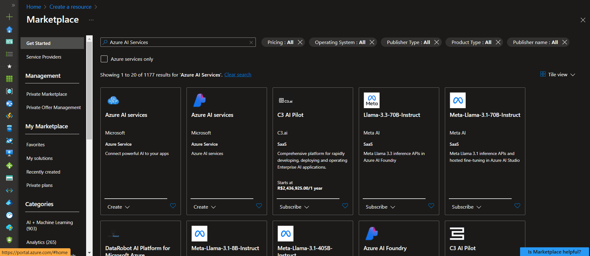
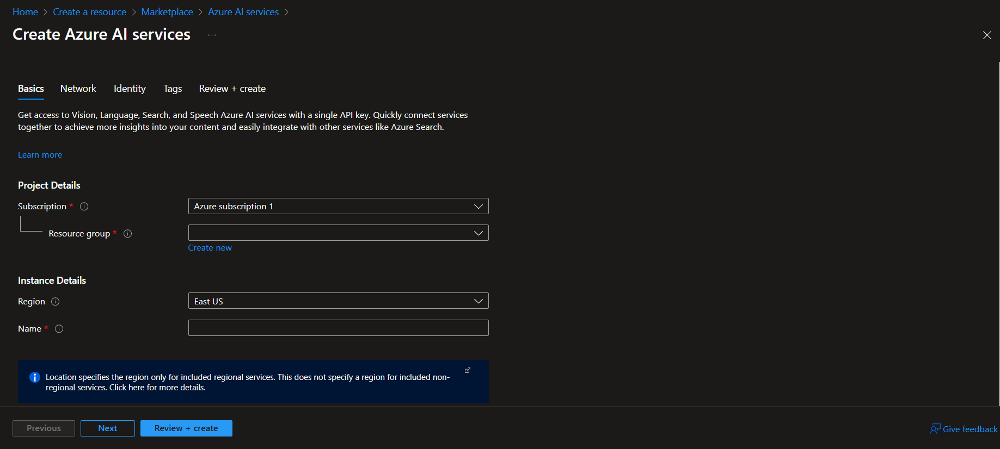
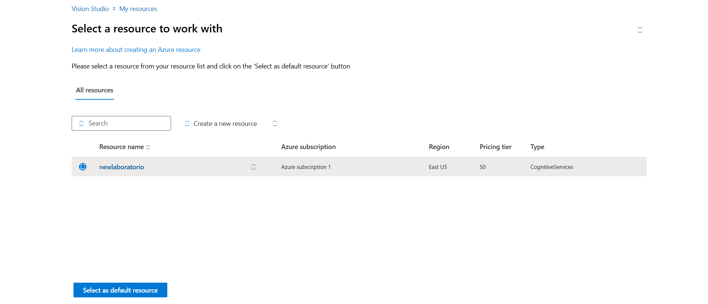

# Reconhecimento Facial e transformação de imagens em Dados no Azure ML

Passo a passo do projeto "Reconhecimento Facial e transformação de imagens em Dados no Azure ML".

Links importantes:

[Detect faces in Vision Studio](https://microsoftlearning.github.io/mslearn-ai-fundamentals/Instructions/Labs/04-face.html)

[Read text in Vision Studio](https://microsoftlearning.github.io/mslearn-ai-fundamentals/Instructions/Labs/05-ocr.html)

[Analyze images in Vision Studio](https://microsoftlearning.github.io/mslearn-ai-fundamentals/Instructions/Labs/03-image-analysis.html)

## Passo 1: Criando recurso do "Azure AI services"

Primeiramente, foi necessário criar um recurso de Machine Learning. Para isso, acessei a opção 'Criar recurso' e, em seguida, pesquisei por 'Azure AI services' no marketplace. Após localizar o recurso desejado, procedi com sua criação.

## Passo 2: Configurando o recurso do "Azure AI services"

Para criar o recurso realizei a seguinte configuração:

- Subscription: Utilizei a minha assinatura do Azure.
- Resource group: Criei um grupo de recursos.
- Region: Selecionei a região “East US”.
- Name: Insiri o nome do laboratório.
- Pricing tier: Standard S0
- By checking this box I acknowledge that I have read and understood all the terms below: Selecionado

Após o prenchimento dos campos citado acima, selecionei o botão "Review + create" e depois cliquei em "Create" e aguardei a conclusão da implantação.

## Passo 3: Conectando o meu "Azure AI services" ao Vision Studio

- Após a criação do recurso, naveguei até o [Vision Studio](https://portal.vision.cognitive.azure.com/).
- Entrei com a minha conta.
- Na página inicial do Vision Studio, selecione a opção "View all resources".
- Na página "Select a resource to work with", selecionei o recurso criado anteriormente.

## Passo 4: Detectar rostos no Vision Studio

- Na página inicial "Get started with Vision", selecionei a guia "Face" e, em seguida, selecionei o bloco "Detect faces in an image".
- Realizei o download das imagens fornecidas na [documentação](https://aka.ms/mslearn-detect-faces) e salvei na pasta "inputs".
- Carreguei as imagens e verifiquei os detalhes de detecção de rosto retornados. Resultados podem ser verificados nas imagens da pasta "outputs".

## Passo 5: Extrair texto de imagens no Vision Studio

- Na página inicial "Get started with Vision", selecionei a guia "Optical character recognition" e, em seguida, o bloco "Extract text from images".
-  Realizei o download das imagens fornecidas na [documentação](https://aka.ms/mslearn-ocr-images) e salvei na pasta "inputs".
-  Carreguei as imagens e verifiquei os detalhes retornados. Resultados podem ser verificados nas imagens da pasta "outputs".

## Passo 6: Gerar legendas para uma imagem

- Na página inicial "Get started with Vision", selecionei a guia "Image Analysis" e, em seguida, o bloco "Add captions to images".
-  Realizei o download das imagens fornecidas na [documentação](https://aka.ms/mslearn-images-for-analysis) e salvei na pasta "inputs".
-  Carreguei as imagens e verifiquei os detalhes retornados. Resultados podem ser verificados nas imagens da pasta "outputs".